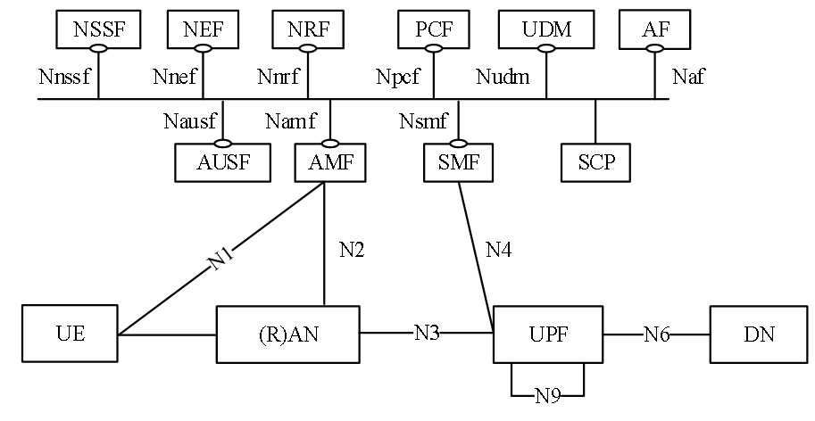
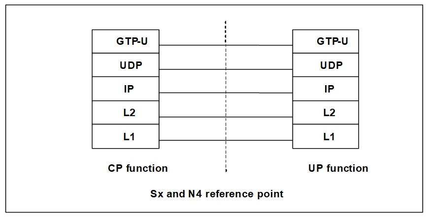
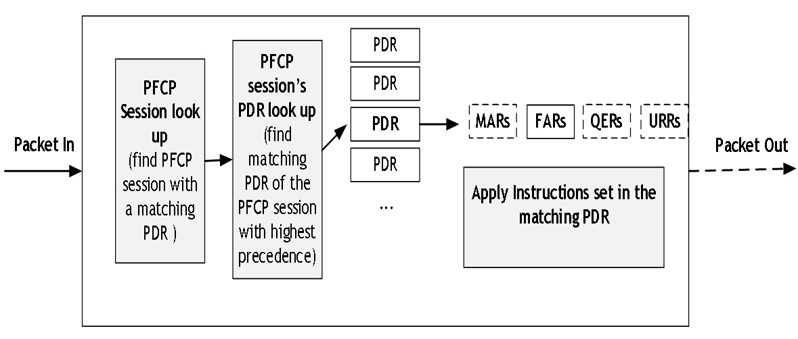
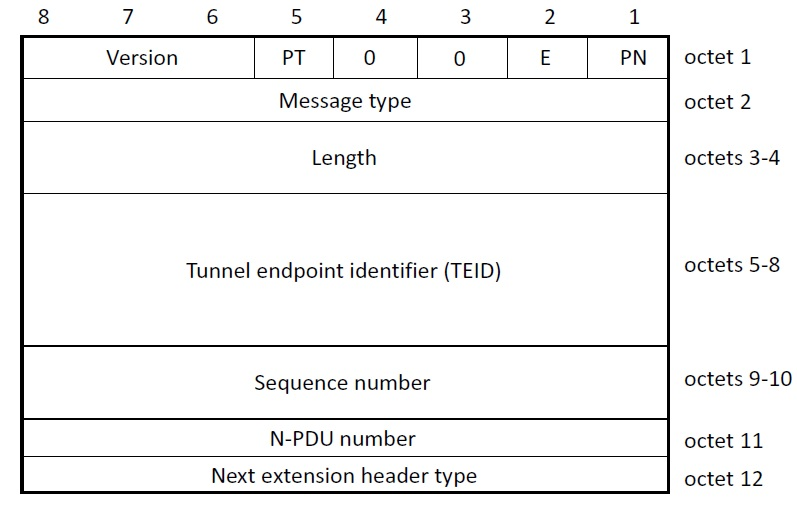
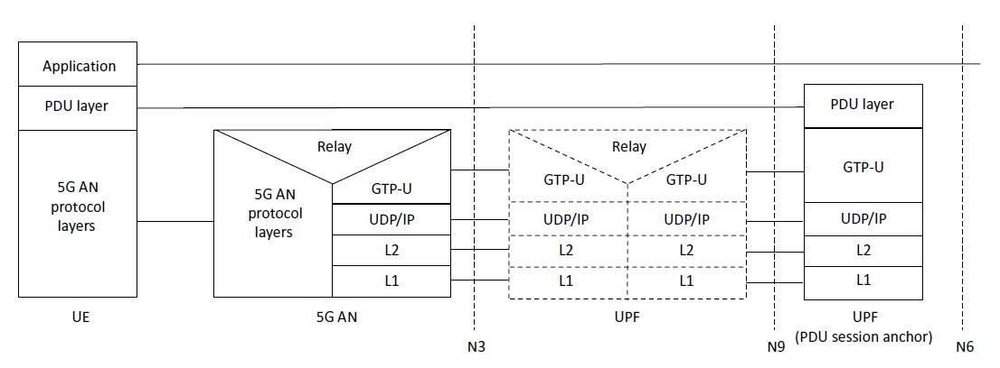
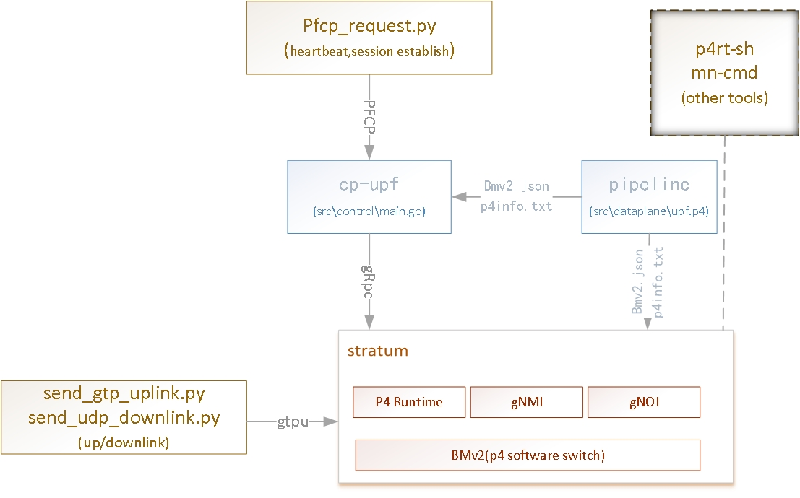

# upf_p4_poc
This project is a proof of concept for 5g upf based on p4.
The project uses open source project to verify key technologies, such as pfcp, p4runtime RPC and programmable dataplane pipeline.

## Related open source projects
1) **go-pfcp** https://github.com/wmnsk/go-pfcp  <br>
PFCP implementation in Golang.This project use go-pfcp to decode/code pfcp message.
2) **p4runtime-go-client** https://github.com/antoninbas/p4runtime-go-client <br>
Go client for P4Runtime.This project use  p4runtime-go-client to connect stratum_bmv2(as swithos and pipeline instance),config pipeline and insert table entry.
3) **scapy** https://github.com/secdev/scapy <br>
Scapy is a powerful Python-based interactive packet manipulation program and library.
This project use it to construct and send PFCP request messages.Also use it to send user plane uplink and downlink data packets for function test.
4) **ngsdn-tutorial** https://github.com/opennetworkinglab/ngsdn-tutorial <br>
Tutorial for Next-generation SDN (NG-SDN).It contains a set of containers, such as p4c, mininet(include stratum-bmv2), onos. Use it as a p4 compilation and test runtime environment.

## What is UPF?
The User Plane Function (UPF) is a fundamental component of a 3GPP 5G core infrastructure system architecture.
It acts as a gateway between the base station and the data network.The UPF identifies user plane traffic flow and action based on information received from control plane network function(as SMF in 5g).

<br>
PFCP(Packet Forwarding Control Protocol) used in CP NF to control UPF,it defined in 3GPP TS29.244.
It is similar to OpenFlow. Maybe consider it  as the southbound interface of the dataplane in the mobile networks.

Packet processing flow in the UP function(ps:I think this processing flow is just an ideal definition, and there are multiple implementations ^_^)

<br>
The GTP (GPRS Tunnelling Protocol) protocol provides protocol channels between mobile access network and  core network. All UE access DN should be encapsulated by the GTP protocol.<br>
GTP-U header.

User plane protocol stack for a PDU session


##Requirements
OS:Ubuntu 18.04 <br>
Go (>= 1.13.3) <br>
ps:maybe need to set proxy  getting package,like me 
```
export GO111MODULE=on
export GOPROXY=https://goproxy.cn
```
docker git python2.7 make ...

#Getting Started
1.Download and Prepare the environment.(one time)
Note：It will take some time to download docker images.
```
git clone 
make deps-env
```
2.Build
Build result in "build" folder.
```
make build
```
3.Runing
The components of poc

Start startum environment,include mininet.see aslo  [ngsdn-tutorial](https://github.com/opennetworkinglab/ngsdn-tutorial) .
```
cd ./ngsdn-tutorial
make start
```
<br>Start cp-upf
<br>Note：replace param as your environment.
```
build/cp-upf --addr ${STRATUMIP}:${STRATUMPORT} -bin bmv2.json -p4info p4info.txt -device-id 1 -n4addr {N4IP}:{N4PORT}
```

4.Test
Mininet config ip by hands.
```
cd ./ngsdn-tutorial
make mn-cli
mininet> h1a ip addr add 193.168.1.2/24 dev h1a-eth0
mininet> h1b ip addr add 193.168.1.3/24 dev h1b-eth0
```
Send PFCP request to create pdu session.The cp-upf receive pfcp messages will translate to some p4table operations.
```
./test_script/pfcp_request.py
```
Send gtpu uplink
```
cd ./ngsdn-tutorial
util/mn-cmd h1a python /mininet/send_gtp_uplink.py
util/mn-cmd h1a tcpdump -i h1a-eth0 -w /tmp/uplink-ue.pcap
util/mn-cmd h1b tcpdump -i h1b-eth0 -w /tmp/uplink-dn.pcap
```
Send gtpu downlink 
```
util/mn-cmd h1b python /mininet/send_udp_downlink.py
util/mn-cmd h1a tcpdump -i h1a-eth0 -w /tmp/downlink-ue.pcap
util/mn-cmd h1b tcpdump -i h1b-eth0 -w /tmp/downlink-dn.pcap
```
# Planning
Add more counter and connect to onos.
<br>Add to cpu and dpi process.
<br>Also I have a plan to coding upf based on ebpf(xdp).that will be a anthor story,but all of them will be one story.


